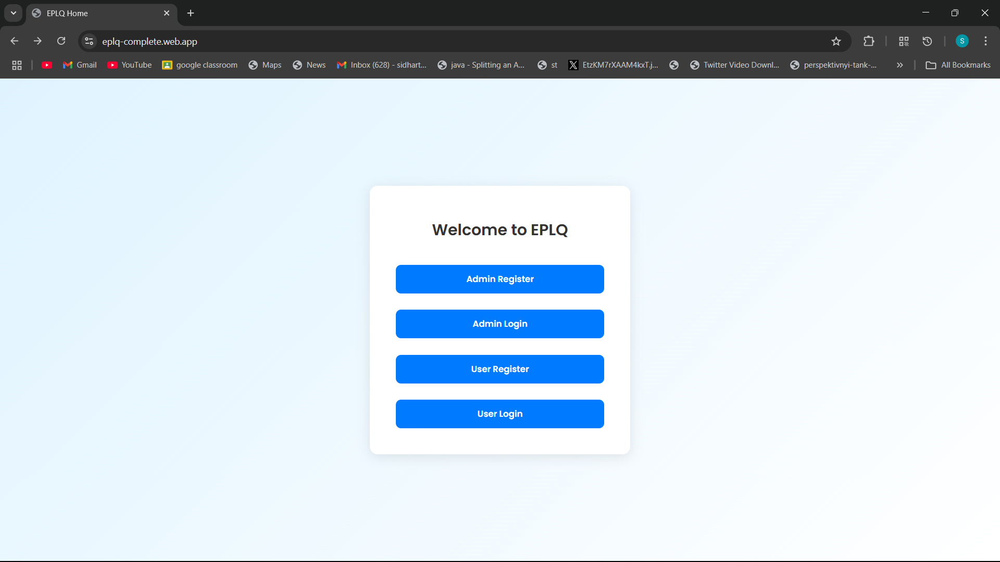
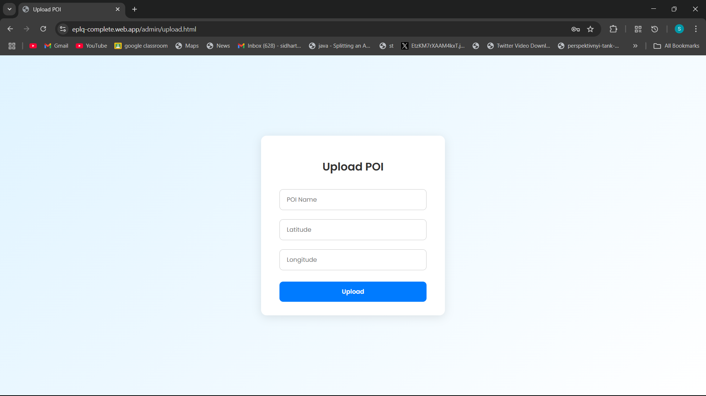

# 🛰️ EPLQ – Efficient Privacy-Preserving Location-Based Query System

A web-based solution that enables secure, privacy-preserving spatial range queries over encrypted Points of Interest (POI) using Firebase. Built with HTML, CSS, and JavaScript.

🔗 **Live Demo:** [https://eplq-complete.web.app](https://eplq-complete.web.app)  
🧪 Note: POIs are stored by the Admin. If no POIs show during user search, please login as Admin and add few  sample locations  
📂 **Repository:** Public • Hosted on Firebase • GitHub Managed

---

## 🚀 Features

### 👤 Admin Module
- Register/Login securely using Firebase Authentication
- Upload encrypted POIs (name + latitude + longitude + description)
- Every action is logged to Firestore

### 🙋 User Module
- Register/Login as a user
- Query POIs within a user-defined radius using Haversine formula
- Encrypted queries ensure location privacy

### 🔐 Security Highlights
- Firebase Authentication (Admin/User separation)
- Firestore rules (read/write restricted to logged-in users)
- Logging for every action (POI uploads, searches, logins)

---

## 🧰 Tech Stack

- **Frontend**: HTML5, CSS3, JavaScript (Vanilla)
- **Backend**: Firebase Authentication, Firebase Firestore, Firebase Hosting
- **Geolocation**: Haversine distance formula (JS)
- **Logging**: JS-based logging to Firestore
- **Deployment**: Firebase CLI + Web Hosting

---

## 🗂️ Folder Structure

```
├── admin/
│   ├── login.html
│   └── register.html
├── user/
│   ├── login.html
│   └── register.html
├── css/
│   └── style.css
├── js/
│   ├── auth.js
│   ├── firebase-config.js
│   └── logger.js
├── index.html
├── 404.html
├── firebase.json
└── .firebaserc
```

---

## 🛠️ How to Run Locally

1. Clone the repository:
   ```bash
   git clone https://github.com/sidhartha2403/eplq-location-privacy-app.git
   ```
2. Open `index.html` in a browser to test locally.

> For full Firebase functionality, you must configure your own Firebase project and replace `firebase-config.js` values.

---

## 🌍 Firebase Deployment

Already deployed to: [https://eplq-complete.web.app](https://eplq-complete.web.app)

To redeploy:
```bash
firebase deploy
```
---

## 🧪 Try It Out as a User (No Admin Login Required)

You can directly register/login as a **User** and test the POI search feature without needing admin access.

### 🔍 Sample Search Input
Use the following details on the **User Search Page**:

- **Latitude**: `17.4910`
- **Longitude**: `78.3920`
- **Radius**: `2` (in kilometers)

### ✅ What You'll See
- Nearby POIs like Police Station, Government Hospital, Metro Station, Pharmacy
- Results filtered by your input radius using geolocation logic
- These POIs are **already uploaded by Admin** and ready for testing

---

## 📍 Available POI Test Data

| POI Name           | Latitude   | Longitude  | Description                  |
|--------------------|------------|------------|------------------------------|
| Police Station     | 17.4945    | 78.3915    | Local police station         |
| Fire Station       | 17.4870    | 78.3850    | Emergency fire services      |
| Govt Hospital      | 17.4923    | 78.3991    | 24x7 healthcare center       |
| Miyapur Metro      | 17.5012    | 78.3960    | Nearest metro station        |
| Apollo Pharmacy    | 17.4899    | 78.3904    | Medical store with 24x7 access |
| Charminar 🕌        | 17.3616    | 78.4747    | Historical landmark (far away) |

### 🧪 Bonus: Filtering Test
The last POI (**Charminar**) is intentionally far away.  
➡️ Try using a radius of **10+ km** to see it included in the results.

---

## 📸 Screenshots

### 🔹 Homepage


### 🔹 Admin Register


### 🔹 Admin Login


### 🔹 Upload POI (Admin)


### 🔹 User Register


### 🔹 User Login


### 🔹 Search POIs (User)


---

## 📌 License

This project is licensed for educational and demonstration purposes.
© 2024 C Sai Sidhartha

---
