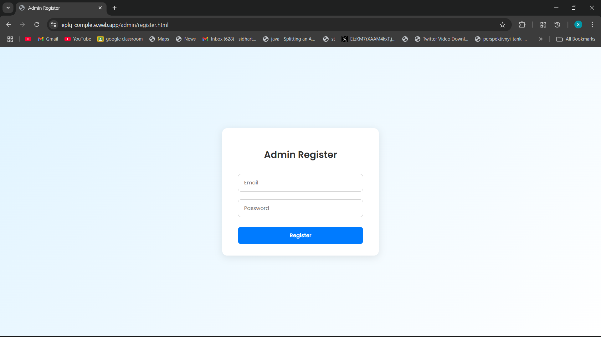

# 🛰️ EPLQ – Efficient Privacy-Preserving Location-Based Query System

A web-based solution that enables secure, privacy-preserving spatial range queries over encrypted Points of Interest (POI) using Firebase. Built with HTML, CSS, and JavaScript.

🔗 **Live Demo:** [https://eplq-complete.web.app](https://eplq-complete.web.app)  
🧪 Note: POIs are stored by the Admin. If no POIs show during user search, please login as Admin and add  few sample locations
📂 **Repository:** Public • Hosted on Firebase • GitHub Managed

---

## 🚀 Features

### 👤 Admin Module
- Register/Login securely using Firebase Authentication
- Upload encrypted POIs (name + latitude + longitude + description)
- Every action is logged to Firestore

### 🙋 User Module
- Register/Login as a user
- Query POIs within a user-defined radius using Haversine formula
- Encrypted queries ensure location privacy

### 🔐 Security Highlights
- Firebase Authentication (Admin/User separation)
- Firestore rules (read/write restricted to logged-in users)
- Logging for every action (POI uploads, searches, logins)

---

## 🧰 Tech Stack

- **Frontend**: HTML5, CSS3, JavaScript (Vanilla)
- **Backend**: Firebase Authentication, Firebase Firestore, Firebase Hosting
- **Geolocation**: Haversine distance formula (JS)
- **Logging**: JS-based logging to Firestore
- **Deployment**: Firebase CLI + Web Hosting

---

## 🗂️ Folder Structure

```
├── admin/
│   ├── login.html
│   └── register.html
├── user/
│   ├── login.html
│   └── register.html
├── css/
│   └── style.css
├── js/
│   ├── auth.js
│   ├── firebase-config.js
│   └── logger.js
├── index.html
├── 404.html
├── firebase.json
└── .firebaserc
```

---

## 🛠️ How to Run Locally

1. Clone the repository:
   ```bash
   git clone https://github.com/sidhartha2403/eplq-location-privacy-app.git
   ```
2. Open `index.html` in a browser to test locally.

> For full Firebase functionality, you must configure your own Firebase project and replace `firebase-config.js` values.

---

## 🌍 Firebase Deployment

Already deployed to: [https://eplq-complete.web.app](https://eplq-complete.web.app)

To redeploy:
```bash
firebase deploy
```

---

## 📸 Screenshots (Add Your Own)
Create a `/screenshots` folder and include PNGs:

```md


```

---

## 📌 License

This project is licensed for educational and demonstration purposes.
© 2024 C Sai Sidhartha

---
